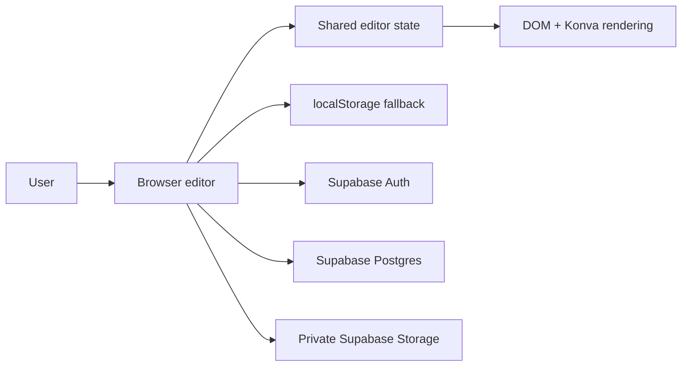

# Cover Generator

A focused browser editor for turning reusable layouts into polished, print-ready architecture and presentation covers.

Design a page visually, place text, images, logos, shapes, and icons, then save the result as a preset or generate a project cover. The experience is local-first for speed, with Supabase providing authentication, durable metadata, and private image storage when configured.

## What it does

- Compose covers with a drag-and-resize editor powered by DOM rendering and Konva.
- Build reusable presets and apply them to new projects.
- Add project photos and reusable brand logos.
- Import and export templates as JSON.
- Undo and redo layout changes.
- Print covers at configured page sizes and orientations.
- Continue using local browser storage when remote persistence is unavailable.

## Stack and architecture

- Vanilla JavaScript modules, HTML, and CSS
- Konva for canvas interaction
- Supabase Auth, Postgres, and Storage
- Static deployment model for Vercel, Netlify, or another HTTPS host

The app has no custom backend server. [index.html](index.html) is the browser entry point, [src/main.js](src/main.js) orchestrates the runtime, [src/state/state.js](src/state/state.js) owns editor state, and [src/data/supabase-client.js](src/data/supabase-client.js) contains the Supabase boundary.



## Quick start

### Requirements

- Node.js 18 or newer
- A modern browser
- Optional: a Supabase project for sign-in and remote persistence

### Install and validate

```bash
npm install
npm test
npm run check
```

This project is a static frontend, so there is no application server to start. For local browser testing, serve the repository over HTTP with any static server. For example:

```bash
npx serve .
```

Then open the URL printed by the command. Opening `index.html` directly may work for basic UI checks, but an HTTP server is recommended for module loading, authentication, and browser security behavior.

## Supabase setup

1. Create a Supabase project.
2. Open **Project Settings > API** and copy the project URL and browser-safe publishable/anon key.
3. Put those values in [supabase-config.js](supabase-config.js).
4. Run [supabase-schema-final.sql](supabase-schema-final.sql) in the Supabase SQL Editor.
5. Verify the policies and storage behavior using [SUPABASE-DEPLOYMENT.md](SUPABASE-DEPLOYMENT.md).
6. Configure the production site URL and allowed redirect URLs in Supabase Auth settings.

Never place a Supabase `service_role` key in browser code. The browser key is expected to be public; Row Level Security is the actual database and storage boundary.

## User workflow

1. Sign in through the auth gate.
2. Open the preset editor and configure the page size, background, and elements.
3. Save the layout as a preset.
4. Open Create Project, enter project metadata, select a preset, and optionally upload a project photo.
5. Generate or reprint the cover through the browser print dialog.
6. Use the brand library to reuse logos across layouts.

## Repository map

- [index.html](index.html): application shell and controls
- [styles.css](styles.css): application and print styling
- [supabase-config.js](supabase-config.js): browser-safe Supabase configuration
- [supabase-schema-final.sql](supabase-schema-final.sql): tables, private bucket, and RLS policies
- [src/main.js](src/main.js): application bootstrap, tabs, hydration, and render loop
- [src/state/state.js](src/state/state.js): shared state, IDs, undo, and redo
- [src/canvas](src/canvas): rendering, selection, drag, resize, snapping, and zoom
- [src/inspector/inspector.js](src/inspector/inspector.js): property and layer editing
- [src/presets/presets.js](src/presets/presets.js): preset persistence and selection
- [src/projects/projects.js](src/projects/projects.js): project creation and printing
- [src/brands/brands.js](src/brands/brands.js): logo upload and management
- [src/template-io.js](src/template-io.js): JSON import/export and normalization
- [src/data/storage.js](src/data/storage.js): guarded localStorage access
- [src/data/supabase-client.js](src/data/supabase-client.js): auth, database, and Storage helpers
- [tests/storage-validation.test.js](tests/storage-validation.test.js): local persistence regression tests

## Data model

The SQL creates three owner-scoped tables:

- `public.presets`: reusable page and element definitions
- `public.projects`: project metadata and preset snapshots
- `public.brand_images`: reusable logo metadata

Uploaded files use the private `cover-images` bucket. New objects are stored under `<user-id>/projects`, `<user-id>/logos`, or `<user-id>/elements`; Storage policies enforce that the first path segment matches `auth.uid()`.

## Security posture

- Supabase Auth gates the editor and remote writes.
- All application tables use owner-only Row Level Security policies.
- The Storage bucket is private and object paths are user-scoped.
- Uploaded URLs are accessed through signed URLs.
- Local storage is treated as a convenience cache, not a trusted source of authorization.

Apply and verify the SQL before production deployment. The full staging and production checklist is in [SUPABASE-DEPLOYMENT.md](SUPABASE-DEPLOYMENT.md).

## Deployment

Build steps are not required because this is a static site. Deploy the repository root to Vercel, Netlify, or equivalent static hosting, then configure:

- HTTPS and the production domain
- Supabase Auth site URL and redirect allow list
- the matching Supabase URL and publishable/anon key
- the database and Storage policies from the final SQL

Run `npm test` and `npm run check` before each release. Perform the authenticated and cross-user checks in [SUPABASE-DEPLOYMENT.md](SUPABASE-DEPLOYMENT.md) against a staging project before promoting to production.

## Known limitations

- There is no custom backend API or server-side rendering pipeline.
- There is no team, role, or collaboration model beyond per-user ownership.
- Print output depends on browser print behavior.
- Local fallback data is device-specific and is not a durable backup.
- Supabase configuration and RLS must be completed separately for each environment.
